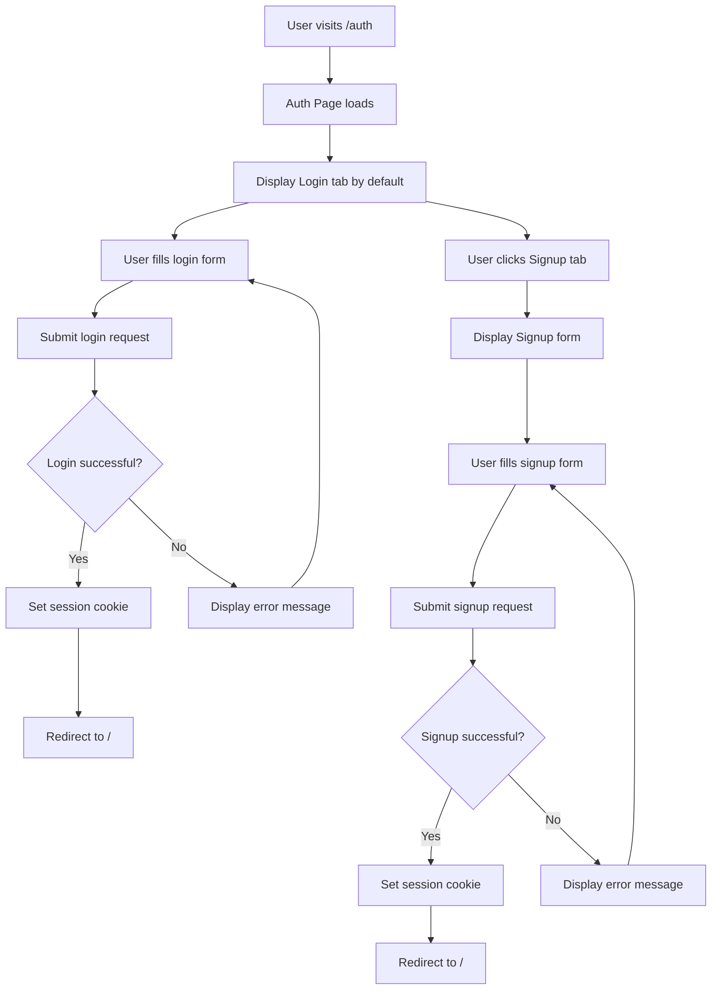
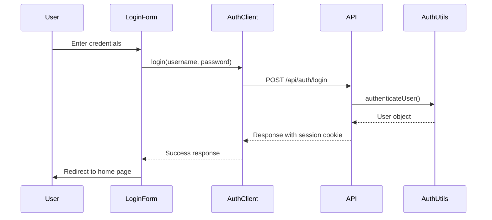

# Auth Component Architecture

## Component Hierarchy

```
/auth (page.tsx)
├── AuthTabs
│   ├── LoginTab
│   └── SignupTab
├── LoginForm (when LoginTab is active)
└── SignupForm (when SignupTab is active)
```

## State Flow



## Data Flow



## Form Validation Logic

### Login Form

- Required fields: username, password
- Basic validation: non-empty values
- API validation: credentials check

### Signup Form

- Required fields: username, password, confirmPassword
- Basic validation: non-empty values
- Password validation: minimum 6 characters
- Password confirmation: passwords must match
- API validation: username uniqueness

## Error Handling Strategy

1. **Client-side validation errors**

   - Display immediately below form fields
   - Prevent form submission until resolved

2. **API response errors**

   - Display at top of form
   - Include specific error messages
   - Clear on form focus or new submission

3. **Network errors**
   - Display generic error message
   - Provide retry option

## Styling Approach

### Design Principles

- Minimal, functional design
- Consistent with existing theme
- Focus on usability over aesthetics
- Mobile-responsive layout

### Component Styling

- Simple borders and padding
- Standard form element styling
- Clear visual feedback for interactions
- Subtle hover and focus states

## Security Considerations

1. **Form Data**

   - No sensitive data in localStorage
   - Secure transmission to API endpoints
   - Proper sanitization of inputs

2. **Session Management**

   - HttpOnly cookies for session storage
   - Automatic session expiration
   - Secure cookie flags in production

3. **Error Messages**
   - Non-specific error messages for security
   - No exposure of system details
   - Rate limiting considerations

## Responsive Design

### Mobile (< 768px)

- Single column layout
- Full-width form elements
- Larger touch targets

### Tablet (768px - 1024px)

- Centered form with max-width
- Optimized spacing

### Desktop (> 1024px)

- Fixed width form container
- Centered on page
- Enhanced visual hierarchy
